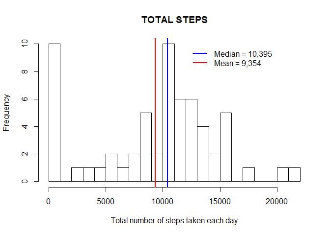
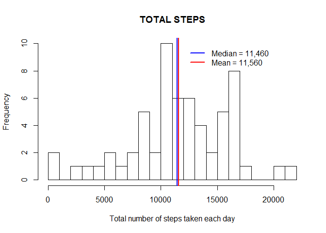

# Reproducible Research: Peer Assessment 1
Jose A Carrasco Lopez  
February 12, 2017  


## R Markdown

This is my first R Markdown document. I hope to get everything right.

## Loading and preprocessing the data

```r
#Getting the needed packages
  library(plyr) 
  library(reshape2)
  library("ggplot2")
# Downloading the file to the WD
  temp <- tempfile()
  download.file("https://d396qusza40orc.cloudfront.net/repdata%2Fdata%2Factivity.zip",     temp)
#Reading the file
  activity <- read.csv(unz(temp, "activity.csv"))
  unlink(temp)
#Casting the data
  stpsd <- dcast(activity, interval ~ date, value.var="steps")
  TotalSteps<- colSums(stpsd[,2:62], na.rm = TRUE)
  summary(TotalSteps)
```

```
##    Min. 1st Qu.  Median    Mean 3rd Qu.    Max. 
##       0    6778   10400    9354   12810   21190
```

## What is mean total number of steps taken per day?


```r
# Plotting the data
  hist(TotalSteps, breaks = 25, xlab = "Total number of steps taken each day", 
     main = "TOTAL STEPS") 
  abline(a=NULL, b=NULL, h= NULL, v=median(TotalSteps), lwd= 2.5, col="blue")
  abline(a=NULL, b=NULL, h= NULL, v= mean(TotalSteps), lwd= 2.5,col="red")
  legend(x=12000, y= 10, c("Median = 10,395 ","Mean = 9,354"),lty=c(1,1),
  lwd=c(2.5,2.5),col=c("blue","red"), bty = "n") 
```

<!-- -->


```
## [1] "the median and mean total of steps taken per day are:"
```

```
## [1] 9354.23
```

```
## [1] 10395
```

## What is the average daily activity pattern?


```r
# Adding a new interval average variable 
  stpsd$IntervalAvrg <-rowMeans(stpsd, na.rm = TRUE)  
# Calculating the 5-minute interval that contains the maximum number of steps
  stpsd[which.max(stpsd$IntervalAvrg),1]
```

```
## [1] 835
```

```r
  max(stpsd$IntervalAvrg)
```

```
## [1] 217.8148
```


```r
ggplot(data=stpsd, aes(x=interval, y=stpsd$IntervalAvrg)) + geom_line(col="blue") + 
  geom_point( size=2, shape=1, col="blue") + xlab("Daily Intervals") +
  ylab("Average Steps")+ ggtitle(" Average Steps by Interval")+
  geom_text(data = stpsd, aes(x = 1300, y = 217.7091, label = "Interval with Max Steps = 835")) 
```

<!-- -->


```
## [1] "The 5 min interval with max average of steps is 835. This interval has 217.8148 steps in average"
```

## Imputing missing values


```r
#Check if there are any missing values:
  anyNA(activity)
```

```
## [1] TRUE
```

```r
#Columnwise check if there are any missing values:
  apply(activity, 2, anyNA)
```

```
##    steps     date interval 
##     TRUE    FALSE    FALSE
```

```r
#Check percentages and counts of missing values in columns:
  colMeans(is.na(activity))*100
```

```
##    steps     date interval 
## 13.11475  0.00000  0.00000
```

```r
  colSums(is.na(activity))
```

```
##    steps     date interval 
##     2304        0        0
```


```
## [1] "The total number of mising values is 2304. All of them are part of the variable steps and they represent 13.11% of the total values."
```


```r
#Adding a new steps average by interval varaible to the DF 
  stpsd$IntervalAvrg <-rowMeans(stpsd, na.rm = TRUE)
#Getting the varaibles with NAs
  nanms<-colnames(stpsd)[apply(is.na(stpsd), 2, any)]
  nanms
```

```
## [1] "2012-10-01" "2012-10-08" "2012-11-01" "2012-11-04" "2012-11-09"
## [6] "2012-11-10" "2012-11-14" "2012-11-30"
```

```r
#Filling in the NAs in the dataset using the mean for each 5-minute interval to create a new dataset equal to the original one but without the missing values.

my.na1001 <- is.na(stpsd$`2012-10-01`)
stpsd$`2012-10-01`[my.na1001] <- stpsd$IntervalAvrg[my.na1001]

my.na1008 <- is.na(stpsd$`2012-10-08`)
stpsd$`2012-10-08`[my.na1008] <- stpsd$IntervalAvrg[my.na1008]

my.na1101 <- is.na(stpsd$`2012-11-01`)
stpsd$`2012-11-01`[my.na1101] <- stpsd$IntervalAvrg[my.na1101]

my.na1104 <- is.na(stpsd$`2012-11-04`)
stpsd$`2012-11-04`[my.na1104] <- stpsd$IntervalAvrg[my.na1104]

my.na1109 <- is.na(stpsd$`2012-11-09`)
stpsd$`2012-11-09`[my.na1109] <- stpsd$IntervalAvrg[my.na1109]

my.na1110 <- is.na(stpsd$`2012-11-10`)
stpsd$`2012-11-10`[my.na1110] <- stpsd$IntervalAvrg[my.na1110]

my.na1114 <- is.na(stpsd$`2012-11-14`)
stpsd$`2012-11-14`[my.na1114] <- stpsd$IntervalAvrg[my.na1114]

my.na1130 <- is.na(stpsd$`2012-11-30`)
stpsd$`2012-11-30`[my.na1130] <- stpsd$IntervalAvrg[my.na1130]
```


```r
# Getting the new data to plot
NTotalSteps<- colSums(stpsd[,2:62], na.rm = TRUE)
summary(NTotalSteps)
```

```
##    Min. 1st Qu.  Median    Mean 3rd Qu.    Max. 
##      41    9819   11460   11560   15080   21190
```

```r
#Plotting the data
hist(NTotalSteps, breaks = 25, xlab = "Total number of steps taken each day", 
     main = "TOTAL STEPS") 
abline(a=NULL, b=NULL, h= NULL, v=median(NTotalSteps), lwd= 2.5, col="blue")
abline(a=NULL, b=NULL, h= NULL, v= mean(NTotalSteps), lwd= 2.5,col="red")
legend(x=12000, y= 10, c("Median = 11,460 ","Mean = 11,560"),lty=c(1,1), lwd=c(2.5,2.5),col=c("blue","red"), bty= "n") 
```

<!-- -->

```
## [1] "These values differ from the estimates from the first part of the assignment. It is clear that NAs have an impact on the final result. Imputing missing data as the average of the steps by interval, forces the mean and median to increase, getting closer to each other"
```

## Are there differences in activity patterns between weekdays and weekends?


```r
#Reshaping the DF
  activity$date <- as.Date(activity$date)
#Creatting a new variable indicating which day is a given date 
  activity$weekdays <- weekdays(activity$date)
  activity$weekdays <- as.factor(activity$weekdays)
  activity$date <- as.factor(activity$date)
#Getting a new DF of average steps by interval and type of day 
  ave<-  dcast(activity, interval ~ weekdays, value.var="steps", na.rm = TRUE, mean)
#Calculating the average interval steps by weekdays and weekend 
  ave$weekday <- rowMeans(ave[,c(2,3,6,7,8)])
  ave$weekend <- rowMeans(ave[,c(4,5)])
```


```r
#Plotting the data
  ggplot(data=ave, aes(x= ave$interval)) + geom_line(aes(y=ave$weekday), col="blue")   + geom_line(aes(y=ave$weekend), col="red")+ xlab("Daily Intervals") +
  ylab("Average Steps")+ ggtitle(" Average Steps by Weekday")+
  geom_text(data = ave, aes(x = 130, y = 200, label = "Weekdays"), col="blue")+
  geom_text(data = ave, aes(x = 125, y = 180, label = "Weekend"),col="red")
```

<!-- -->


```
##    Min. 1st Qu.  Median    Mean 3rd Qu.    Max. 
##   0.000   2.303  24.230  35.620  52.600 237.000
```

```
##    Min. 1st Qu.  Median    Mean 3rd Qu.    Max. 
##   0.000   1.107  32.040  43.080  75.570 175.000
```

```
## [1] "The activity patterns on weekdays and weekends are different. The activity starts earlier during the weekdays than during the weekend, reaching  a max around interval 835. During weekend the activity looks more intense in average"
```
